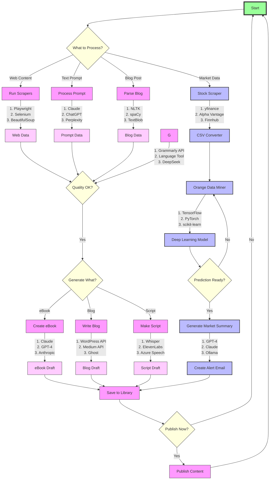

# Alexandrea Library Workflow with AI Platforms

```mermaid
flowchart TD
    %% Main Flow
    A[Start] --> B{What to Process?}
    
    %% Input Sources with AI
    B -->|Web Content| C[Run Scrapers]
    C -->|"1. Playwright\n2. Selenium\n3. BeautifulSoup"| C1[Web Data]
    
    B -->|Text Prompt| D[Process Prompt]
    D -->|"1. Claude\n2. ChatGPT\n3. Perplexity"| D1[Prompt Data]
    
    B -->|Blog Post| E[Parse Blog]
    E -->|"1. NLTK\n2. spaCy\n3. TextBlob"| E1[Blog Data]
    
    B -->|Market Data| S[Stock Scraper]
    
    %% Market Premisions Branch with AI
    S -->|"1. yfinance\n2. Alpha Vantage\n3. Finnhub"| T[CSV Converter]
    T --> U[Orange Data Miner]
    U -->|"1. TensorFlow\n2. PyTorch\n3. scikit-learn"| V[Deep Learning Model]
    V --> W{Prediction Ready?}
    W -->|No| U
    W -->|Yes| X[Generate Market Summary]
    X -->|"1. GPT-4\n2. Claude\n3. Ollama"| Y[Create Alert Email]
    
    %% Content Processing
    C1 & D1 & E1 --> F{Quality OK?}
    G -->|"1. Grammarly API\n2. Language Tool\n3. DeepSeek"| F
    
    %% Content Generation with AI
    F -->|Yes| H{Generate What?}
    
    H -->|eBook| I[Create eBook]
    I -->|"1. Claude\n2. GPT-4\n3. Anthropic"| I1[eBook Draft]
    
    H -->|Blog| J[Write Blog]
    J -->|"1. WordPress API\n2. Medium API\n3. Ghost"| J1[Blog Draft]
    
    H -->|Script| K[Make Script]
    K -->|"1. Whisper\n2. ElevenLabs\n3. Azure Speech"| K1[Script Draft]
    
    %% Final Steps
    I1 & J1 & K1 & Y --> L[Save to Library]
    L --> M{Publish Now?}
    M -->|Yes| N[Publish Content]
    M -->|No| A
    N --> A

    %% Styling
    classDef start fill:#9f9,stroke:#333,stroke-width:4px
    classDef process fill:#f9f,stroke:#333
    classDef decision fill:#ffd,stroke:#333
    classDef market fill:#bbf,stroke:#333,stroke-width:2px
    classDef ai fill:#fcf,stroke:#333,dashed
    
    %% Node Classifications
    class A start
    class B,F,H,M,W decision
    class C,D,E,G,I,J,K,L,N process
    class S,T,U,V,X,Y market
    class C1,D1,E1,I1,J1,K1 ai
```