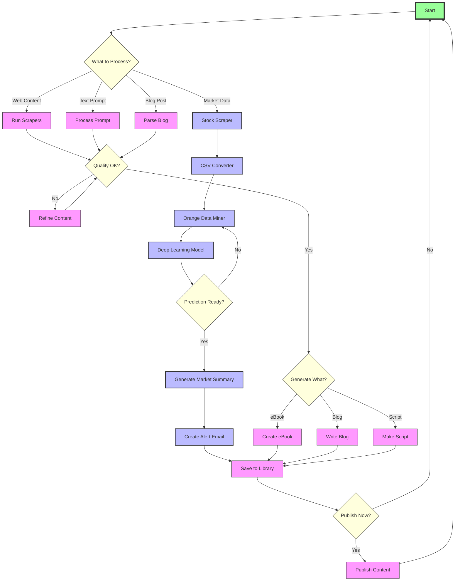

# Alexandrea Library Workflow

```mermaid
flowchart TD
    %% Main Flow
    A[Start] --> B{What to Process?}
    
    %% Input Choices
    B -->|Web Content| C[Run Scrapers]
    B -->|Text Prompt| D[Process Prompt]
    B -->|Blog Post| E[Parse Blog]
    B -->|Market Data| S[Stock Scraper]
    
    %% Main Processing Branch
    C & D & E --> F{Quality OK?}
    F -->|No| G[Refine Content]
    G --> F
    F -->|Yes| H{Generate What?}
    
    %% Market Premisions Branch
    S --> T[CSV Converter]
    T --> U[Orange Data Miner]
    U --> V[Deep Learning Model]
    V --> W{Prediction Ready?}
    W -->|No| U
    W -->|Yes| X[Generate Market Summary]
    X --> Y[Create Alert Email]
    Y --> L
    
    %% Content Generation
    H -->|eBook| I[Create eBook]
    H -->|Blog| J[Write Blog]
    H -->|Script| K[Make Script]
    
    %% Final Steps
    I & J & K --> L[Save to Library]
    L --> M{Publish Now?}
    M -->|Yes| N[Publish Content]
    M -->|No| A
    N --> A

    %% Styling
    classDef start fill:#9f9,stroke:#333,stroke-width:4px
    classDef process fill:#f9f,stroke:#333
    classDef decision fill:#ffd,stroke:#333
    classDef market fill:#bbf,stroke:#333,stroke-width:2px
    
    %% Node Classifications
    class A start
    class B,F,H,M,W decision
    class C,D,E,G,I,J,K,L,N process
    class S,T,U,V,X,Y market
```
