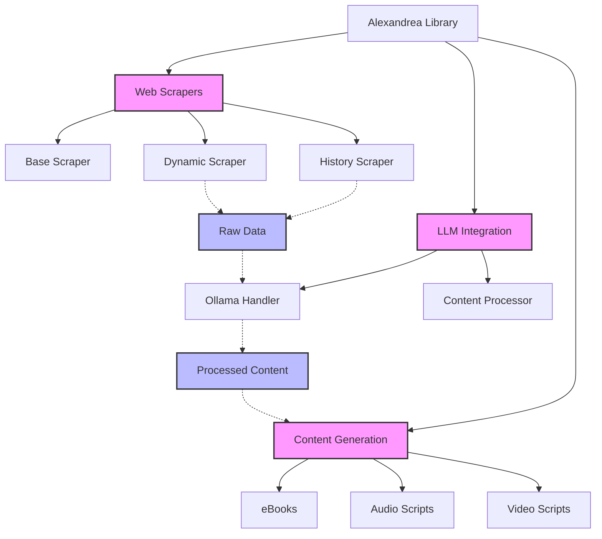

# Alexandrea Library Architecture

```mermaid
graph TD
    A[Alexandrea Library] --> B[Web Scrapers]
    A --> C[LLM Integration]
    A --> D[Content Generation]
    
    %% Web Scrapers Module
    B --> B1[Base Scraper]
    B --> B2[Dynamic Scraper]
    B --> B3[History Scraper]
    
    %% LLM Integration Module
    C --> C1[Ollama Handler]
    C --> C2[Content Processor]
    
    %% Content Generation
    D --> D1[eBooks]
    D --> D2[Audio Scripts]
    D --> D3[Video Scripts]
    
    %% Data Flow
    B2 -.-> E[Raw Data]
    B3 -.-> E
    E -.-> C1
    C1 -.-> F[Processed Content]
    F -.-> D
    
    %% Styling
    classDef module fill:#f9f,stroke:#333,stroke-width:2px
    classDef data fill:#bbf,stroke:#333,stroke-width:2px
    class B,C,D module
    class E,F data
```