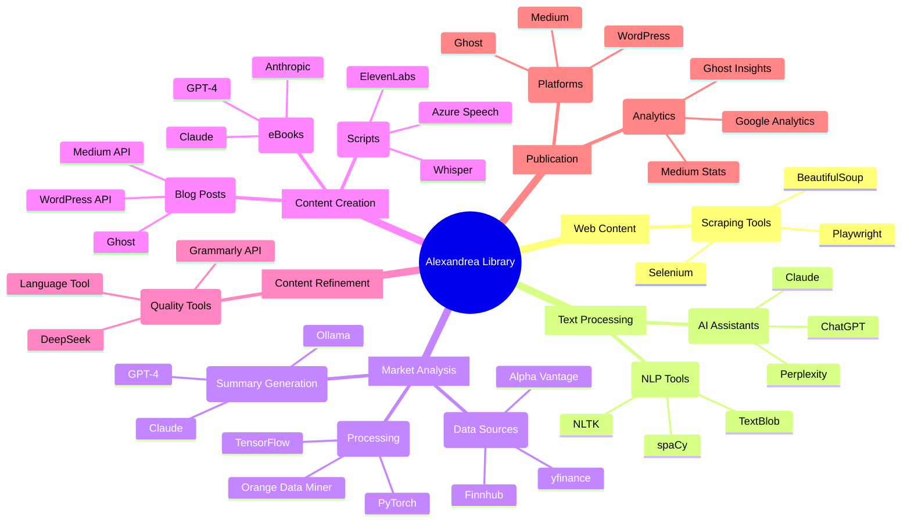

# Alexandrea Library AI Platform Integration

```mermaid
mindmap
  root((Alexandrea Library))
    %% Web Content Branch
    [Web Content]
      (Scraping Tools)
        Playwright
        Selenium
        BeautifulSoup
    
    %% Text Processing Branch
    [Text Processing]
      (AI Assistants)
        Claude
        ChatGPT
        Perplexity
      (NLP Tools)
        NLTK
        spaCy
        TextBlob
    
    %% Market Analysis Branch
    [Market Analysis]
      (Data Sources)
        yfinance
        Alpha Vantage
        Finnhub
      (Processing)
        Orange Data Miner
        TensorFlow
        PyTorch
      (Summary Generation)
        GPT-4
        Claude
        Ollama
    
    %% Content Generation
    [Content Creation]
      (eBooks)
        Claude
        GPT-4
        Anthropic
      (Blog Posts)
        WordPress API
        Medium API
        Ghost
      (Scripts)
        Whisper
        ElevenLabs
        Azure Speech
    
    %% Quality Control
    [Content Refinement]
      (Quality Tools)
        Grammarly API
        Language Tool
        DeepSeek

    %% Distribution
    [Publication]
      (Platforms)
        WordPress
        Medium
        Ghost
      (Analytics)
        Google Analytics
        Medium Stats
        Ghost Insights
```